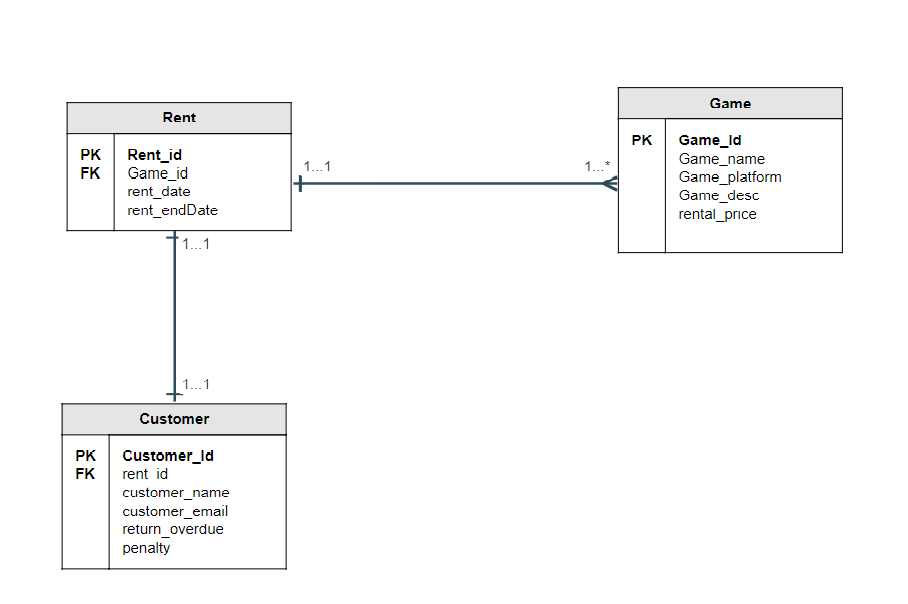
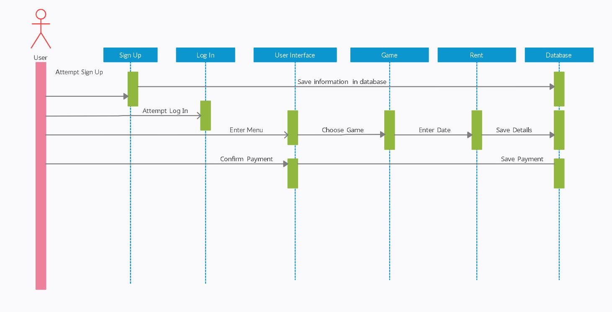

# Final Project Web App

## Project Title : Online Game Rental

## INTRODUCTION
As the project title suggests, this web application allows the user to rent video games online.  
There are many video games available for user to select from. The selection of video games can  
be varied based on the platform, whether it is an console exclusive and PC. The user need to  
create an account in order to rent video games available in the web app and each rent will be  
recorded in the web app to keep track with the rental expiration period and if the user didn't  
manage to give the game back before the rental expiration period, he or she will be fined accordingly.  
## OBJECTIVE
As other rental systems we know, there are many and various different styles and purposes. For  
our objective for this project firstly, we want to allow users to rent multiple kinds of  their  
favourite video games from different platforms. By this user can have an experience to play various  
kinds of games from different platform.Moreover, like other rental systems, it can help users to  
have other choices by providing this alternative especially for gamers a chance to play different  
kinds of games they like. 

## FEATURES AND FUNCTIONALITY
In Online game rental,the features and functionality provided are firstly, Sign Up for first time  
users, then they can Login for users that have already registered and Logout. After the user login  
into the system, it will navigate them to the page that shows a  list of  various types of video  
games available with different types of platform , by then users can choose whatever games they like  
and click the rent button. Furthermore, users can give ratings and comments on the game they rented  
so it will be referenced for other users before they want to rent the game. Also it will help admin  
to make an improvement about the features in the system regarding the feedback that the user leaves  
in the comment.

## MODEL, VIEWS, CONTROLLER AND DATABASE ERD WITH ONE TO MANY RELATIONSHIP
**MODEL**  
Model for this web application consists of 2 parts, which is staff.php and User.php. Staff.php handles  
the insertion of game details entered by staff and then, the game list will be displayed on the user  
page for the user to rent their favourite games. As for the User.php model, this model handles the  
registration data of the new user as well as login input. Every data entered by the user will be stored  
inside the database in order for the web application to fetch the data every time when the user logs into  
the web application.  

The creation of the model file comes with the migration file, where we can create tables inside the database.  
Inside the file, table staff was created in order to allow staff to store game details in the web application.  
As for the user table, the table was created together with authentication scaffolding. This table allows the  
system to store user account data for the purpose of registration and login.

**CONTROLLER**  
Controller for this web application consists of 2 parts which is staffController.php is a page that handles  
all incoming requests related to staff, including showing, creating, updating, and deleting staff. The details  
of the games can be created in this controller and updated. The staff can also delete the games or details from  
the system. Home.controller is  a page that handles all incoming requests related to users, including showing,  
creating, updating, and deleting users. Users can create their profile by registering. Users also can add the  
details of the rental for the games they want to rent.

**VIEWS**  
The base view for the web application is base.blade.php is a page that provides UI like bootstrap and css to show  
on every other page. This page will support all other pages for the UI of the system.  

*STAFF*  
The views of this staff web application consists of 4 parts which is index.blade.php is a page for staff that  
displays the list of games and adds new game details. Create.blade.php is a page for the staff to add new games  
to the system. The details of games that were added are name, platform, description and price. Edit.blade.php is  
a page for the staff to edit the details of the games that were added to the system. Show.blade.php is a page for  
staff to display a list of  the game details that have already been created. This page will show to the user the  
list of games that were added by the staff.  
 
*USER*  
The user view for the web application consists of 2 parts which is home.blade.php shows a list of games to rent in  
the system. The user can choose the games they want to rent in the system. The user needs to click the rent button  
and will be redirected to create.blade.php. Create.blade.php is a page for the user to key in the rental details  
like the dates and time. All the information will be saved in the database and will be updated. The games that have  
been rented will be prompted as unavailable.    
 

**Database**  
The database used in this project is gamerental.sql. The database consists of staff details,games details and user  
details. The users need to register first and then log in to the system. The emails and password from the user is  
saved in the database.  

## A SEQUENCE	DIAGRAM	TO REPRESENT THE INTERACTION	OF THE	WEB	APPLICATION  
This is the sequence diagram for this web application. As shown in the figure below, the sequence consists of a user  
sign up and login attempt, followed by choosing a game to rent and then proceed to entering rent details and payment  
details.   
**SEQUENCE DIAGRAM**

## REFERENCES

- http://www.commodityrentals.com/videogames.php
- https://www.gamefly.com/games
- https://i.stack.imgur.com/BbaRt.jpg    

## WORK DELEGATIONS

| Name                               | Task         |
|------------------------------------|--------------|
| AHMAD SYAHRIL DANIAL BIN CHE ZAINAL| Staff page   |
| MUHAMMAD IZZUDDIN BIN SUHAILI      | User page    |
| FAIQ SHAHMY BIN SHALIZAM           | Welcome page |

